## 零、 信号预处理

### 0.1信号数字化

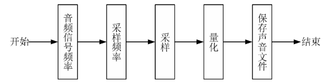

### 0.2 基础概念

- 时域 vs 时频域
- 功率谱 vs 相位谱 vs 幅度谱
- 特征：FBank、MFCC（GCC、SCM）、Gammatone谱、目标幅度谱TMS、LPS（Log-power Spectral）
  - Gammatone 是模拟人耳耳蜗滤波后的特征，通常还会继续执行对数操作以便压缩参数的范围，这样也会更加符合人耳的听觉效应。
  - 短时傅里叶变换幅度谱、对数功率谱以及梅尔谱都可以作为 TMS 预测的特征，在不考虑相位的情况下，直接将带噪语音的相位与增强幅度谱相乘生成增强语音的时域波形。

## 一、 基础方法

主要分为传统的语音增强算法和基于深度学习 的语音增强算法

- 传统的
  - 谱减法
  - 维纳滤波
- 深度学习的（目前的工作主要在网络模型、输入特征和训练目标三个方向进行优化，在训练目标的研究中，多目标学习是被研究的方向之一。  ）
  - 时频掩蔽：IBM，当信噪比大于局部阈值时，IBM会给这个掩蔽赋值为1，否则赋值为0.
    - 有效提高语音可懂度分数，但有意图噪声残留过多，导致语音质量收到影响。
    - 理想比值掩蔽：IRM
    - 频域幅度掩蔽：SMM
    - 相位敏感掩蔽：PSM
    - 复数理想比值：cIRM，可以有效利用频域中的相位信息，更加有效地重构语音波形。cIＲM 同时利用了复数频谱的实部和虚部对语音波形进行重构，便于网络学习语音的相位信息 。
  - 特征映射
    - 频谱映射
    - 波形映射
  - 信号近似，Signal Approximation, SA  
    - 结合了时频掩蔽和特征映射算法的优点，将掩蔽和目标幅度谱同时作为训练目标

### 1.1 维纳滤波

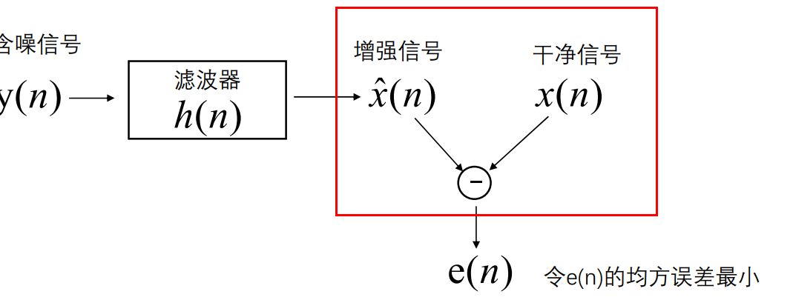

- 基于语音和噪声统计独立性，使用MMSE准则进行降噪。
  
- 通过最小均方误差计算得到：(推导详情见《1.语音增强维纳滤波》)
  $$
  H(w_k)= \frac {P^*_{yx}(w_k)}{P_{yy}(w_k)}
  $$

- 物理意义
  - 推导得$H(w_k) = \frac {\xi_k}{\xi_k +1}$，其中$\xi=\frac{P_{xx}w_k}{P_{nn}(w_k)}$为先验信噪比
  - 当信噪比大的时候，允许信号通过；当信噪比小的时候，抑制信号通过。（$\alpha_k$为先验信噪比）
  
- 变种
  - 平方根维纳滤波：保证增强后的能量谱与干净语音的能量谱相同
  
  - 参数型维纳滤波：根据噪声大小的不同选择不同的参数
    $$
    H(w_k)=(\frac{\xi_k}{\xi_k+\alpha})^\beta
    $$
    
  
- 优缺点：有效的抑制了音乐噪声的产生，但是它基于信号的平稳性假设这一假设，因此在面对非平稳噪声时性能会下降

- 代码：代码见《1.wiener》

### 1.2 子空间法

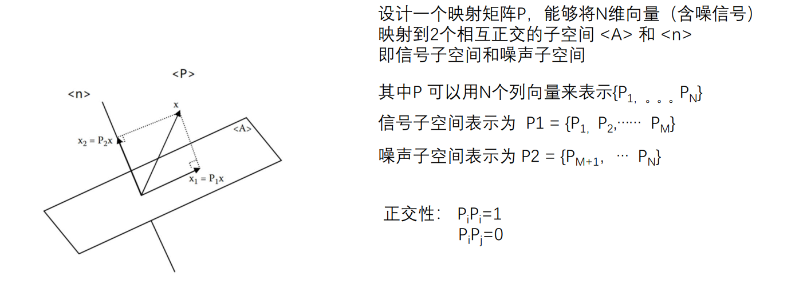

- 本质：本质事寻找一个H能够将含噪信号y映射成干净的信号x(推导见《2.语音增强子空间法》)，核心思想史将带噪信号看作一个向量空间，则纯净语音的信号和噪声信号就可以被看作它内部的两个正交子空间。
- 参考论文：Hu, Y. and Loizou, P. (2003). A generalized subspace approach for enhancing speech corrupted by colored noise. IEEE Trans. on Speech and Audio Processing, 11, 334-341  
- 代码：《2.subspace》

### 1.3 谱减法

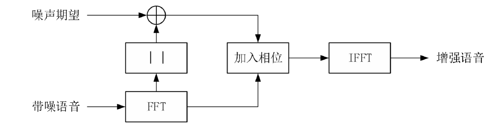

- 推导见《3.specsub推导》
- 具体步骤：
  - 对原始信号进行分帧、加窗处理，求每帧的FFT
  - 求噪声的FFT，并求均值
  - 进行谱减
    - 其中谱减部分具体有三种方法：
      （1）利用幅度谱进行谱减。 （推导中④式）
      （2）利用功率谱进行谱减。 （推导中⑤式，alpha取2）
      （3）alpha-beta法进行改进，可以减少音乐噪声（推导中⑤式）
  - 复原出原始声音信号
- 变种
  - 过减法（乘以系数加权）
  - 引入平滑机制（对于过小的值用相邻帧的最小值取代）
- 优点：
  - 计算量不大，且性能稳定
- 缺点：
  - 谱减法的有效性基于噪声的平稳性这一前提，但现实的噪声信号具有短时平稳性，这会导致  音乐噪声==噪声残留  的产生

### 1.4 MMSEE（计算和推导复杂）

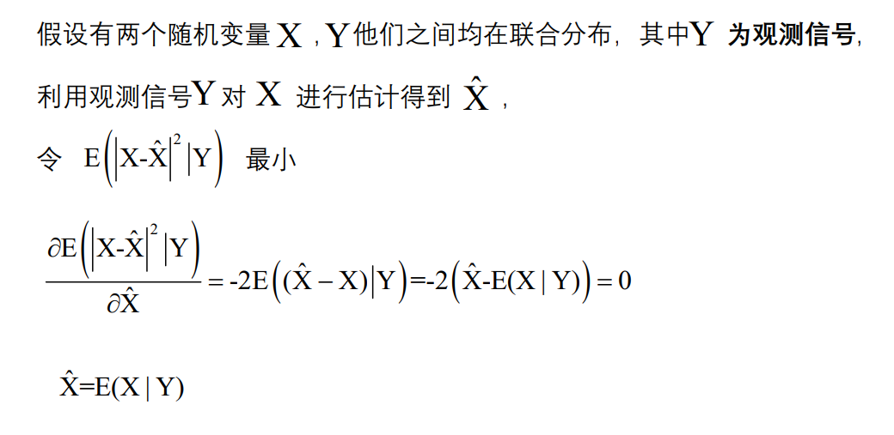

- 最小均方误差估计（Minimum Mean Square Error Estimation）  

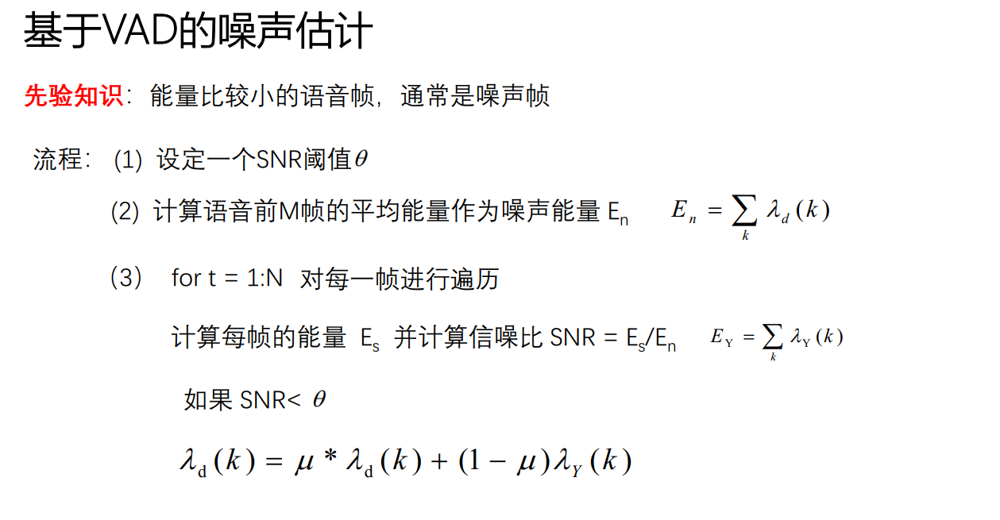

- 优缺点：
  - 是一种非线性的估计，语音失真程度最低，但是在高信噪比条件下性能不佳

-----------------------------------------------------------------------------------------------------------------------------------------------------------

基于深度学习的方法：

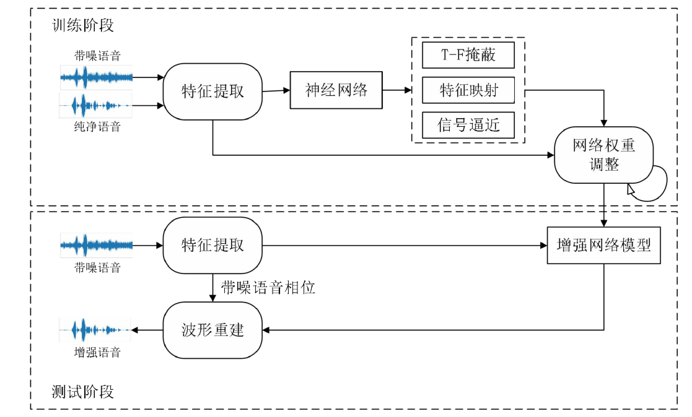

### 1.5 DNN频谱映射

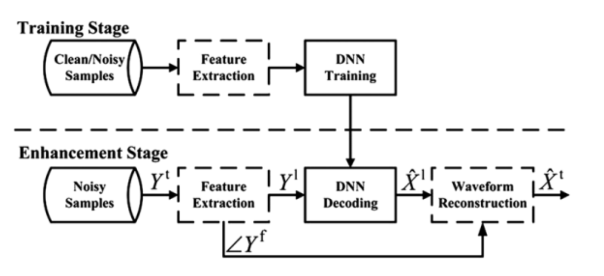

### 1.6 DNN-IRM

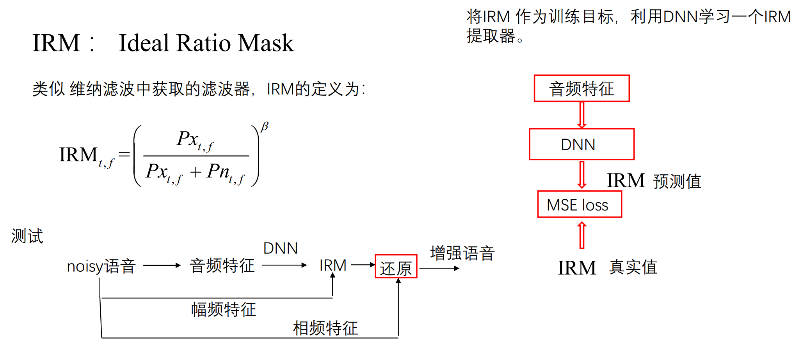

### 1.7 GAN

## 二、 complex domain

- 过去：只对语音的幅值谱进行了处理而忽略了相位的作用。  
- encoder-decoder：在保证帧与帧之间独立的同时又可以提取到相邻频点之间的特征信息  

## 三、 attention

## 四、 loss

- PASE特征损失

## 五、 评价指标

- 主观评价指标

  - MOS，Mean Opinion Score。MOS 评定方法是让测试者都处在相同的环境中，根据事先指定的评价标准来对听到的测试语音进行打分。MOS 得分范围可以分为五个等级，语音的质量越高，等级也就越高。

    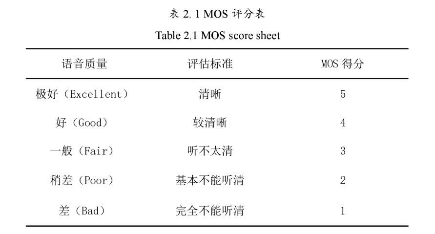

- 客观评价指标

  - PESQ，Perceptual Evaluation of Speech Qualify，语音质量感知估计。[-0.5,4.5]，使用于大多数环境，与人的主观评估标准比较接近，侧重于语音清晰度。

    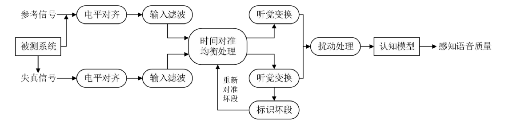

  - STOI，Short Time Objective Intelligently，短时客观可懂度。[0,1]，语音可懂度，在低信噪比条件下，听懂语音内容比听清语音更有意义。

    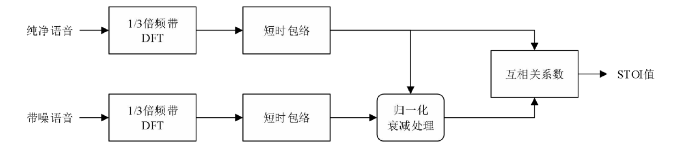

  - segSNR，Segmental SNR，分段信噪比。语音具有非平稳性，相对于短时平稳而言，根据能量集中的范围可以将它分为搞高能量和低能量区域，不同能量区域对于理解语音的重要性也是不同的，因此需要分段进行计算。

    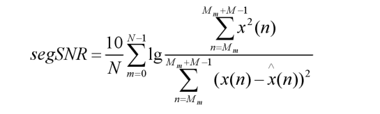

  - LSD，Log Spectral Distance，对数谱失真度。

## 六、 数据集

- TIMIT+NOISE92
  - TIMIT 语料库包含 630 个说话者的宽带录音，每个人 10 条语音丰富的句子，一共 6300 句
  - NoiseX92 是专门为了噪声鲁棒性训练与评估而设计的噪声库，包含了 15 种日常生活中常见的噪声类型。白噪声（White Noise），车内噪声（Volvo Noise），军用车辆噪音（Leopard Noise），坦克内部噪声（M109 Noise），餐厅内嘈杂噪声（Babble Noise），高频信道噪声（Hfchannel Noise），粉红噪声（Pink Noise），机枪噪声（Machinegun Noise），工厂车间噪声 1（Factory Noise 1），工厂车间噪声 2（Factory Noise 2），F16 座舱噪声（F-16 Noise），驱逐舰机舱噪声（Destroyerengine Noise），驱逐舰作战室背景噪音（Destroyerops Noise），Buccaneer 驾驶舱噪声 （Buccaneer2），Buccaneer 驾驶舱噪声 2（Buccaneer2）。
  - 训练初始增强模型的实验随机从 TIMIT 训练集中选取 200 个句子，在 5 个信噪比水平（-10dB、-5dB、0 dB，5 dB 和 10 dB）下被 NoiseX92 噪声库中 15 种噪声类型破坏得到。一共使用 15000 条（200 *15 Noise * 5 SNR）混合语句来训练初始语音增强模型。
  - 训练评价指标网络的实验**从 TIMIT 训练集中随机选取 200 句纯净语音作为训练语句，从TIMIT 测试集中选取 100 句做测试语音**。从 NoiseX92 噪声数据库中的全部 15 种噪声来参与训练，在 21 个信噪比的条件下（-10 dB~10 dB，1 dB 的步长）和噪声混合来合成带噪语音，一共 63000 条（200 语句 * 15  Noise * 21 SNR）混合语句。
  - 为了更具有挑战性的实验条件，每个句子只在一个信噪比水平上被一个噪声类型破坏，因此所有的训练数据都是独一无二的，以便学习不同语音条件的评估映射功能。将这批带噪语音通过本文提前训练好的语音增强模型增强，得到的降噪语音与对应的纯净语音一起作为**训练集**。**测试集**中的 100 句纯净语音分别与 5 种噪声进行合成，这 5 种噪声分别为背景交谈噪声（Babble Noise），驱逐舰作战室背景噪音（Destroyerops Noise），工厂车间噪声（Factory Noise1），粉红噪声（Pink Noise），白噪声（White Noise），在 5 个信噪比（-10 dB、-5dB、0 dB，5 dB 和 10 dB）的条件下合成带噪语音，得到 2500 句（100 * 5 Noise * 5 SNR）混合语句，每条纯净语音只在一个信噪比水平上被一个噪声类型破坏。
- THCHS-30+NOISE92

## 参考论文及其链接

- [x] 1 基于评价指标网络的语音增强优化研究（多目标）

  - 评价指标（**PESQ+STOI**）+增强模型：联合训练
  - 数据集：TIMIT+NoiseX92
  - 实验：不同信噪比、不同噪声。
    - *每个句子只在一个信噪比水平上被一个噪声类型破坏
    - 增强网络根据输入特征的不同分为频域模型和时域模型
    - *原始\不同评价指标\损失函数带来的频谱图的效果也不同（噪声残留、谐波结构清晰与否）
    - 对低频和高频的影响不同，MSE优化的是低频部分、高频对听觉影响较大

  > MATLAB measure：[dakenan1/Speech-measure-SDR-SAR-STOI-PESQ: Speech quality measure of SDR、SAR、STOI、ESTOI、PESQ via MATLAB (github.com)](https://github.com/dakenan1/Speech-measure-SDR-SAR-STOI-PESQ)

- [x] 2 基于复值掩蔽与扩张卷积的实时语音增强方法  （*IRM vs cIRM）

  - 实时语音增强、复值遮掩
  - encoder输入语音stft后的实部和虚部，decoder输出IR
  - 损失函数：**PASE**
  - 评价指标：PESQ+STOI
  - 实验：实验中对实时性进行了验证

  > [[2005.11611\] Exploring the Best Loss Function for DNN-Based Low-latency Speech Enhancement with Temporal Convolutional Networks (arxiv.org)](https://arxiv.org/abs/2005.11611)

- [x] 3 基于多目标联合优化的语音增强方法研究  

  - 过去的方法：通常是对单个输出目标进行损失函数的计算，多目标之间并行的，并没有充分利用多目标之间可能存在的关联。因此本文提出了**多目标联合，双输出（语音和噪声）**
  - 损失函数：SISDR、MSE
  - 数据集：THCHS-30+NOISEX-92+MS-SNSD
  - 实验分析：实验分析结合了ASR进行分析

  > 也许可以结合ASR
  >
  > 同时输出目标语音的对数功率谱（Log-Power Spectral, LPS）、 梅尔频率倒谱系数（Mel Frequency Cepstrum Coefficient, MFCC）和 IBM，并对三者进行联合优化  [Multiple-target deep learning for LSTM-RNN based speech enhancement | IEEE Conference Publication | IEEE Xplore](https://ieeexplore.ieee.org/document/7895577)

- [x] 4 基于区域自适应多尺度卷积的单声道语音增强算法  

  - 多尺度卷积堆叠：提升模型整体的信息感知能力
  - 数据集：TIMIT+NoiseX92

- [x] 5 基于动态选择机制的低信噪比单声道语音增强算法  

  - 形变卷积
  - 基于注意力的动态选择机制
  - **渐进学习**（Recursive Learning，Monaural Speech Enhancement with Recursive Learning in the Time Domain）
  - 数据集：TIMIT+NoiseX92

  > [haoxiangsnr/A-Convolutional-Recurrent-Neural-Network-for-Real-Time-Speech-Enhancement: A minimum unofficial implementation of the "A Convolutional Recurrent Neural Network for Real-Time Speech Enhancement" (CRN) using PyTorch (github.com)](https://github.com/haoxiangsnr/A-Convolutional-Recurrent-Neural-Network-for-Real-Time-Speech-Enhancement)
  >
  > [Andong-Li-speech/RTNet: implementation of Monaural Speech Enhancement with Recursive Learning in the Time Domain (github.com)](https://github.com/Andong-Li-speech/RTNet)
  >
  > [Andong-Li-speech (AndongLi) / Repositories (github.com)](https://github.com/Andong-Li-speech?tab=repositories)

