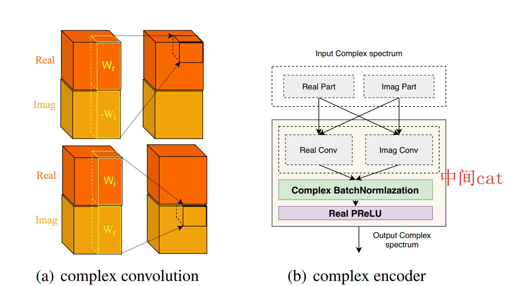
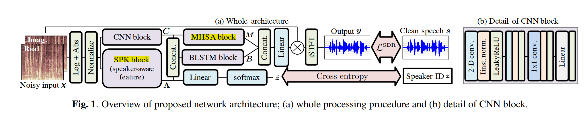

## 零、 信号预处理

### 0.1信号数字化


### 0.2 基础概念

- 时域 vs 时频域
- 功率谱 vs 相位谱 vs 幅度谱
- 特征：FBank、MFCC（GCC、SCM）、Gammatone谱、目标幅度谱TMS、LPS（Log-power Spectral）
  - Gammatone 是模拟人耳耳蜗滤波后的特征，通常还会继续执行对数操作以便压缩参数的范围，这样也会更加符合人耳的听觉效应。
  - 短时傅里叶变换幅度谱、对数功率谱以及梅尔谱都可以作为 TMS 预测的特征，在不考虑相位的情况下，直接将带噪语音的相位与增强幅度谱相乘生成增强语音的时域波形。
- causal vs Non-causal，real-time vs non-real-time
- 宽带 vs 超宽带

## 一、 基础方法


主要分为传统的语音增强算法和基于深度学习 的语音增强算法

- 传统的（含噪信号是高能信号与低能噪声叠加的信号，可以通过傅里叶变换的频域滤波实现降噪。）
  - 谱减法
  - 维纳滤波
- 深度学习的（目前的工作主要在网络模型、输入特征和训练目标三个方向进行优化，在训练目标的研究中，多目标学习是被研究的方向之一。  ）
  - 时频掩蔽：IBM，当信噪比大于局部阈值时，IBM会给这个掩蔽赋值为1，否则赋值为0.
    - 有效提高语音可懂度分数，但有意图噪声残留过多，导致语音质量收到影响。
    - 理想比值掩蔽：IRM
    - 频域幅度掩蔽：SMM
    - 相位敏感掩蔽：PSM
    - 复数理想比值：cIRM，可以有效利用频域中的相位信息，更加有效地重构语音波形。cIＲM 同时利用了复数频谱的实部和虚部对语音波形进行重构，便于网络学习语音的相位信息 。
  - 特征映射
    - 频谱映射
    - 波形映射
  - 信号近似，Signal Approximation, SA  
    - 结合了时频掩蔽和特征映射算法的优点，将掩蔽和目标幅度谱同时作为训练目标

> - 模型：DNN-RNN-CNN-GAN-transformer
>
> - 训练目标：
>   - Masking：IBM-IRM-PSM-CRM
>   - Mapping：Spectral magnitude - complex spectral - waveform

- 多通道：
  - 空间滤波：利用声源定位
  - 盲源分离：利用声援之间的独立性，麦克风数需大于声源个数，混响条件下性能会下降
  - 计算听觉场景分析：模拟人类听觉系统

### 1.1 维纳滤波


- 基于语音和噪声统计独立性，使用MMSE准则进行降噪。
  
- 通过最小均方误差计算得到：(推导详情见《1.语音增强维纳滤波》)
  $$
  H(w_k)= \frac {P^*_{yx}(w_k)}{P_{yy}(w_k)}
  $$

- 物理意义
  - 推导得$H(w_k) = \frac {\xi_k}{\xi_k +1}$，其中$\xi=\frac{P_{xx}w_k}{P_{nn}(w_k)}$为先验信噪比
  - 当信噪比大的时候，允许信号通过；当信噪比小的时候，抑制信号通过。（$\alpha_k$为先验信噪比）
  
- 变种
  - 平方根维纳滤波：保证增强后的能量谱与干净语音的能量谱相同
  
  - 参数型维纳滤波：根据噪声大小的不同选择不同的参数
    $$
    H(w_k)=(\frac{\xi_k}{\xi_k+\alpha})^\beta
    $$
    
  
- 优缺点：有效的抑制了音乐噪声的产生，但是它基于信号的平稳性假设这一假设，因此在面对非平稳噪声时性能会下降

- 代码：代码见《1.wiener》

### 1.2 子空间法


- 本质：本质事寻找一个H能够将含噪信号y映射成干净的信号x(推导见《2.语音增强子空间法》)，核心思想史将带噪信号看作一个向量空间，则纯净语音的信号和噪声信号就可以被看作它内部的两个正交子空间。
- 参考论文：Hu, Y. and Loizou, P. (2003). A generalized subspace approach for enhancing speech corrupted by colored noise. IEEE Trans. on Speech and Audio Processing, 11, 334-341  
- 代码：《2.subspace》

### 1.3 谱减法


- 推导见《3.specsub推导》
- 具体步骤：
  - 对原始信号进行分帧、加窗处理，求每帧的FFT
  - 求噪声的FFT，并求均值
  - 进行谱减
    - 其中谱减部分具体有三种方法：
      （1）利用幅度谱进行谱减。 （推导中④式）
      （2）利用功率谱进行谱减。 （推导中⑤式，alpha取2）
      （3）alpha-beta法进行改进，可以减少音乐噪声（推导中⑤式）
  - 复原出原始声音信号
- 变种
  - 过减法（乘以系数加权）
  - 引入平滑机制（对于过小的值用相邻帧的最小值取代）
- 优点：
  - 计算量不大，且性能稳定
- 缺点：
  - 谱减法的有效性基于噪声的平稳性这一前提，但现实的噪声信号具有短时平稳性，这会导致  音乐噪声==噪声残留  的产生

### 1.4 MMSEE（计算和推导复杂）


- 最小均方误差估计（Minimum Mean Square Error Estimation）  


- 优缺点：
  - 是一种非线性的估计，语音失真程度最低，但是在高信噪比条件下性能不佳

-----------------------------------------------------------------------------------------------------------------------------------------------------------

基于深度学习的方法：


### 1.5 DNN频谱映射Mapping


### 1.6 DNN-IRM


### 1.7 GAN


## 二、 complex domain

- 过去：只对语音的幅值谱进行了处理而忽略了相位的作用。  早期主要是使用幅度谱，重构语音信号的时候使用的是噪声的相位谱。从而使语音增强的性能存在一定的上限，但是相位的建模确实是具有挑战性的，难以直接预测出纯净语音的相位谱。
- encoder-decoder：在保证帧与帧之间独立的同时又可以提取到相邻频点之间的特征信息

### 2.1 

- paper：2017, Complex spectrogram enhancement by convolutional neural network with multi-metrics learning, [Fu](https://github.com/JasonSWFu). [[Paper]](https://arxiv.org/pdf/1704.08504.pdf)

- 解决的问题：

  - 问题一：the difficulty of phase estimations

    - estimating clean real and imaginary (RI) spectrograms from noisy ones.

    - 从不同的channel进行实部和虚部的计算。Rather than processing the phase directly, the network aims to estimate clean RI spectrograms from  noisy ones. 

        

  - 问题二：a single objective function cannot consider multiple metrics simulataneously

    - log-power spectrogram (LPS)  
    - segmental signal-to-noise ratio (SSNR)   

- 相位与幅度之间的不同

  - 高信噪比的条件下，使用噪声相位信息可以得到很好的增强效果，因为噪声相位和干净语音的相位相似。$\arctan\frac{N_i}{N_r} = \arctan \frac{S_i+n_i}{S_r+n_r}$，具体推导见论文
  - 低信噪比的条件下，相位信息丢失严重

  

- 实验：

  - 数据集：TIMIT + 5种噪声
  - 对比不同相位在不同SNR条件下
  - 对比不同的baseline

> 因为高频意味着高的短时平均过零率，低频意味着低的短时平均过零率，所以浊音时具有较低的过零率，而清音时具有较高的过零率。
>
> 1. 利用短时平均过零率可以从背景噪声中找出语音信号，
> 2. 可以用于判断寂静无话段与有话段的起点和终止位置。
> 3. 在背景噪声较小的时候，用平均能量识别较为有效，在背景噪声较大的时候，用短时平均过零率识别较为有效。

### 2.2 

- paper：2017, Time-Frequency Masking in the Complex Domain for Speech Dereverberation and Denoising, Williamson. [[Paper]](https://ieeexplore.ieee.org/abstract/document/7906509)
- 任务：monaural speech separation in reverberant and noisy environments.   
- 问题：
  - is limited since they only enhance the magnitude response, and use reverberant and **noisy phase** during signal reconstruction.  
    - we enhance the magnitude and phase by performing separation with an estimate of the complex ideal ratio mask.   （cIRM）
    - This approach jointly enhances the magnitude and phase response of noisy speech by estimating the complex ideal ratio mask (cIRM) in the real and imaginary domains.   
    - we propose to use DNNs to learn a mapping from reverberant (and noisy) speech to the cIRM.  
- 实验：
  - 针对混响，using simulated and real room   

### 2.3

- 2019, PHASEN: A Phase-and-Harmonics-Aware Speech Enhancement Network, Yin. [[Paper]](https://arxiv.org/abs/1911.04697) [[PHASEN]](https://github.com/huyanxin/phasen)

- 问题

  - 

  - 使用双流网络，而不是cIRM，其实就是换成了相位预测、幅度预测、通过谐波去重构phase。

    

      * 两个流之间有交互，提高相位预测的质量（在上一篇论文中指出，直接使用双流网络去预测相位谱并不可靠，独立的相位预测是不可靠的）
      * we propose frequency transformation blocks to catch long-range correlations along the frequency axis.  
      * learned transformation matrix可以捕获**谐波（harmonics）**相关系数，Visualization shows that the learned transformation matrix spontaneously captures the harmonic correlation, which has been proven to be helpful for T-F spectrogram reconstruction.   
          * **Visualization of FTB weights  ：**to insert frequency transformation blocks (FTBs) to capture global correlations along the frequency axis.
          * **Two-Stream Architecture**     
    * The **loss** consists of two parts: amplitude loss La and phase-aware loss Lp.  
    * 数据集：ACSpeech+AudioSet、Voice Bank+DEMAND

### 2.4

2019, Phase-aware Speech Enhancement with Deep Complex U-Net, Choi. [[Paper]](https://arxiv.org/abs/1903.03107) [[DC-UNet]](https://github.com/chanil1218/DCUnet.pytorch)


  * 主要思路：之前的工作主要为“使用幅度谱和重构噪声的相位谱”的方式去构造语音增强系统<--噪声的相位谱+去噪语音的幅度谱 --> 去估计纯净语音的相位谱
  * 解决方法：关于“相位重构困难的问题”
      * Deep Complex U-Net
      * polar coordinate-wise complex-valued masking  
      * a novel loss function, weighted source-to-distortion ratio (wSDR) loss  
* 论文中的附录：
  * **实数值卷积和复数值卷积**，因为实部和虚部都很重要呀
  * **是否有限制的mark组合相位和幅度**，tanh的有限制更好
  * **Loss**
  * code:[Phase-aware Speech Enhancement with Deep Complex U-Net | Papers With Code](https://paperswithcode.com/paper/phase-aware-speech-enhancement-with-deep-1)

### 2.5

2020, Learning Complex Spectral **Mapping** With Gated Convolutional Recurrent Networks for Monaural Speech Enhancement, [Tan](https://github.com/JupiterEthan). [[Paper]](https://web.cse.ohio-state.edu/~wang.77/papers/Tan-Wang.taslp20.pdf) [[GCRN]](https://github.com/JupiterEthan/GCRN-complex)

  * 通过幅度和相位直接重构语音是比较困难的，而且相位预测更加困难。
  * 可视化：相位谱+平滑 vs 非平滑
  * Gated
  * CRN：Complex Spectral Mapping with a Convolutional Recurrent Network for Monaural Speech Enhancement，

### 2.6

单通道：[[2105.02436\] DBNet: A Dual-branch Network Architecture Processing on Spectrum and Waveform for Single-channel Speech Enhancement (arxiv.org)](https://arxiv.org/abs/2105.02436)

- [driving-behavior/DBNet: DBNet: A Large-Scale Dataset for Driving Behavior Learning, CVPR 2018 (github.com)](https://github.com/driving-behavior/DBNet)

- **动机：**不同噪声在时域和频域的表现不同

  - 对于冲击信息，时域更合适
  - 对于单频信号，频域更合适

- 网络结构：同时做时域和频域（Bridge Layer）

- 实验基线：WSJ0

  - CRN，时域，幅度谱，4.5M
  - GCRN，频域，复数谱，9.67M
  - AECNN，时域，时频波形，18M

- CRN

  - Unet-like
  - Estimate real & imaginary spectrum separately

- DCUNET

  - complex convolution
  - jointly estimate real & imaginary spectrum

- DCCRN

  

  - combine the advantage of CRN and DCUnet，as well as meet the small footprint and low-latency requirement

  - unet-structured complex-valued network with LSTM to model temporal context

  - 推导：

    - complex-valued convolution filter and inputs can be defined like
      $$
      W = W_r + jW_i
      $$

      $$
      X = X_r + jX_i
      $$

    - The convolution can easily  be defined as 
      $$
      F = (X_r*W_r-X_i*W_i)+j(X_r*W_i+X_i*W_r)
      $$

    - similarly,we can get a naive complex LSTM
      $$
      F_{rr}=LSTM_r(X_r)
      $$

      $$
      F_{ir}=LSTM_r(X_i)
      $$

      $$
      F_{ri}=LSTM_i(X_r)
      $$

      $$
      F_{ii}=LSTM_i(X_i)
      $$

      $$
      F_{out}= (F_{rr}-F_{ii}) + j(F_{ri}-F_{ir})
      $$

  - complex encoder/decoder

    

    - complex conv2d layer/complex convtransposed2d layer
    - complex batch normalization layer
    - real prelu

  - Training target of DCRNN is a Complex ratio mask
    $$
    CRM = \frac{Y_rS_r+Y_iS_i}{Y_r^2+Y_i^2}+j\frac{Y_rS_i-Y_iS_r}{Y_r^2+Y_i^2}
    $$

    - The estimated mask cartesian coordinate representation
      $$
      M^e=M^e_r+jM_i^e
      $$

    - it is also can be expressed in polar coordinates
      $$
      M^e_{mag} = \tanh(\sqrt{M_r^{e2} + M_i^{e2}} )
      $$

      $$
      M^e_{phase} = \arctan2({M_r^{e} + M_i^{e}} )
      $$

    - The clean speech can be estimated as
      $$
      DCRRN-R
      $$

      $$
      DCCRN-C
      $$

      $$
      DCCRN-E
      $$

    - Loss funcation
      $$
      Loss = -SISNR(istft(S^e),s)
      $$

  - Dynamic data augmentation

- DCCRN+

  

  - subband processing

    - Learnable subband and split and merge moudules to reduce model size and computational cost，实现了降采样的过程，语音里面的低频部分能量比较高（谐波成分比较明显），高频部分的能量比较低，但是是类噪的，因此高频的降噪是具有挑战的
    - neural network based learnable subband split and merge
      - split block
      - 
    - merge block
  
- **Complex TF-LSTM Block**  --> attention是都能够继续改进 
  
  
  
    - Modeling frequency domain sequence and time domain sequence
  - 先频域建模，在时域建模，可见论文模块b
  
- Convolution pathway
  
  - aggregate richer information from encoder output
  
- SNR Esinmator
  
    - SNR estimation as MTL to maintain good speech quality while reducing noise
    - Problem：directly training neural noise suppressor --> certain amount of speech distortion
    - solution:add frame-level SNR estimator under MTL framework
      - network:1 LSTM + 1 Conv1D w/ sigmoid
      - label
        - extract the amplitude spectrum after STFT
      - Calcalate the log energy of noise and speech based on amplitude spectrum
  
- post-processing
  
  - remove residual noise
  
  - https://imybo.github.io/dccrn-plus

### 2.7 

  * 2020, T-GSA: Transformer with Gaussian-Weighted Self-Attention for Speech Enhancement, Kim. [[Paper]](https://ieeexplore.ieee.org/document/9053591) 

    

    

    

### 2.8

  * 2020, Phase-aware Single-stage Speech Denoising and Dereverberation with U-Net, Choi. [[Paper]](https://arxiv.org/abs/2006.00687)

## 三、 attention

### 3.1

2020,[[2002.05873\] Speech Enhancement using Self-Adaptation and Multi-Head Self-Attention (arxiv.org)](https://arxiv.org/abs/2002.05873



- 方法：
  - 加上了speaker特征，未知说话者（generalization  vs ）
    - 使用辅助的向量
    - 或者直接使用自注意力进行抽取
  - 多任务学习Loss
- 说话者的特征信息或许可以参考语音合成
- 数据集：VoiceBank-DEMAND   

### 3.2 

2020,[[2009.01941\] Dense CNN with Self-Attention for Time-Domain Speech Enhancement (arxiv.org)](https://arxiv.org/abs/2009.01941)

- DCN with attention
- **with a loss** based on the spectral magnitude of enhanced speech.  
- **Causal convolution  ： real-time** vs Non-Causal 

## 四、 loss

- MSE
- SDR
- PESQ/STOI
- PASE特征损失

## 五、 评价指标

- 主观评价指标

  - MOS，Mean Opinion Score。MOS 评定方法是让测试者都处在相同的环境中，根据事先指定的评价标准来对听到的测试语音进行打分。MOS 得分范围可以分为五个等级，语音的质量越高，等级也就越高。

    

  > - 需要训练有素的听众
  > - 需要消耗更多的时间成本和人力成本
  > - 测听者受多种因素影响，容易影响到主观评价结果，如个体受试者的偏好和实验的环境(其他条件)。

- 客观评价指标

  - PESQ，Perceptual Evaluation of Speech Qualify，语音质量感知估计。[-0.5,4.5]，使用于大多数环境，与人的主观评估标准比较接近，侧重于**语音清晰度。**

    

    > PESQ算法没有提供传输质量的综合评估。它只测量单向语音失真和噪声对语音质量的影响。响度损失、延迟、侧音、回声和其他与双向互动相关的损伤(如中央削波器)的影响不会反映在PESQ分数中。因此，有可能有很高的PESQ分数，但整体连接质量很差。

  - STOI，Short Time Objective Intelligently，短时客观可懂度。[0,1]，语音可懂度，在低信噪比条件下，听懂语音内容比听清语音更有意义。**（基于清晰度指数）**

    

  - segSNR，Segmental SNR，分段信噪比。语音具有非平稳性，相对于短时平稳而言，根据能量集中的范围可以将它分为搞高能量和低能量区域，不同能量区域对于理解语音的重要性也是不同的，因此需要分段进行计算。
  
    
    $$
    x(n) ：原始(干净)信号
    x^{(n)}：增强信号
    N：帧长
  M：信号中的帧数量
    $$
  
    > SNRseg有一个潜在问题，语音信号(在会话语音中非常丰富)在安静期间的信号能量非常小，导致较大的负SNRseg值，这将使整体评估出现偏差。为了解决这一问题可以使用VAD检测的方法在只有语音段才计算信噪比。另外一种方法就是限制信噪比在一定范围内如[-10, 35dB]这样就不需要额外进行VAD检测。
    >
    > 后续研究通过将 log 函数移动 1 提出了分段 SNR 的不同定义，这样做可以避免在沉默(silent)语音帧期间获得大的负值的可能性。 因为SNRseg_R的最小可值现在为零而不是负无穷大。 上述分段 SNR 定义的主要优点是它避免了对语音和无语音帧进行显式标记的需要。 即：
  >
    > 

  - LSD，Log Spectral Distance，对数谱失真度。
  
  - SNR：有用信号功率与噪声功率的比（此处功率为平均功率），也等于幅度比的平方
    $$
  SNR(dB)=10log){10}\frac{∑^{N−1}_{n=0}s^2(n)}{∑^{N−1}_{n=0}d^2(n)}=10∗log_{10}(\frac {P_{signal} }{P_{noise}})=20∗log_{10}(\frac{A_{signal}}{A_{noise}})
    $$
  
    $$
  SNR(dB)=10\log_{10}\frac {∑{N−1}_{n=0}s^2(n) }{∑_{N−1}^{n=0}[x(n)−s(n)]^2}
    $$
  
    $$
  P_{signal}：信号功率（平均功率或者实际功率）功率等于幅度值的平方；
    $$
  
    $$
  P_{noise}：噪声功率
    $$
  
    $$
  A_{signal}：信号幅度
    $$
  
    $$
  A_{noise}：噪声幅度值
    $$
  
  - fwSNRseg：频率加权分段信噪比（Frequency-weighted Segmental SNR，fwSNRseg）与SegSNR相似，只是在频带上增加了一个平均。频带与耳朵的临界频带成正比。FWSSNR可定义为：
    
    - 与时域 SNRseg相比，fwSNRseg 可以为频谱的不同频段设置不同权重。 在选择感知动机(motivated)的频率间隔方面（例如临界频带间隔）也具有灵活性。
    
    - 
      
      - $W_j$：第j个频带的权重
      - K：频带的数量
      - M：信号的帧数
      - $X(j,m)$：纯净信号在第j个频带第m帧处的滤波器组 幅值(amplitude) （第m帧第j个频带经过高斯形窗加权的干净信号频谱）
      - $X*(j,m)$：同一频带增强信号的滤波器组 幅值(amplitude)
      
    - ```
      import pysepm
      fwSNRseg = pysepm.fwSNRseg(clean_speech, enhanced_speech, fs)
      ```
  
  - PSNR
  
    - 表示信号的最大瞬时功率和噪声功率的比值，最大瞬时功率为语音数据中最大值得平方。
  
    - ```
      def psnr(label, logits):
          MAX = np.max(label) ** 2  # 信号的最大平时功率
          MSE = np.mean((label - logits) ** 2)
          return np.log10(MAX / MSE)
      ```
  
  > - [pesq库](https://github.com/ludlows/python-pesq)： pip install pesq 
  > - [pysepm库](https://github.com/schmiph2/pysepm)：pip install https://github.com/schmiph2/pysepm/archive/master.zip 
  > - [pystoi 库](https://github.com/mpariente/pystoi)：pip install pystoi 
  > - [语音主观和客观评价总结与实现 - 凌逆战 - 博客园 (cnblogs.com)](https://www.cnblogs.com/LXP-Never/p/11071911.html)

## 七、 基于神经网络的语音质量度量(deep Queality)

### 7.1 AutoMOS

[2016_AutoMOS: Learning a non-intrusive assessor of naturalness-of-speech](https://arxiv.org/abs/1611.09207)


### 7.2 QuealityNet

paper：[2018_Quality-Net: An End-to-End Non-intrusive Speech Quality Assessment Model based on BLSTM](https://arxiv.org/abs/1808.05344)

code：https://github.com/JasonSWFu/Quality-Net

### 7.3 NISQA

- paper：
  - [2019_Non-intrusive speech quality assessment for super-wideband speech communication networks](https://ieeexplore.ieee.org/document/8683770)（older NISQA (v0.42)）
  - [2020_Deep Learning Based Assessment of Synthetic Speech Naturalness](https://www.isca-speech.org/archive/Interspeech_2020/abstracts/2382.html)（NISQA-TTS）
  - [2020_Full-reference speech quality estimation with attentional Siamese neural networks](https://ieeexplore.ieee.org/document/9053951)（double-ended NISQA model）
  - [2021_NISQA: A Deep CNN-Self-Attention Model for Multidimensional Speech Quality Prediction with Crowdsourced Datasets](https://arxiv.org/abs/2104.09494)（NISQA model or the NISQA Corpus）
- code：https://github.com/gabrielmittag/NISQA

- 作用：估计超宽带质量。
  - 近年来，通过将可用音频带宽从窄带扩展到宽带，再到超宽带，语音通信网络的质量得到了显著提高。
  - 这种带宽扩展标志着我们从普通的老式电话服务中所知道的典型的沉闷声音的结束。提高语音质量的另一个原因是全数字分组传输。
- 版本对比：
  - 在老版本中：该模型主要用于预测超宽带语音传输的质量。能够准确预测Opus、EVS等现代编解码器的丢包隐藏质量影响。
  - 在新版本中：模型添加了 影响语音质量的四个维度(噪声、着色(Coloration)、不连续和响度 )的客观评价

### 7.4 MOSNet

- 【论文】[2019_MOSNet: Deep Learning based Objective Assessment for Voice Conversion](https://arxiv.org/abs/1904.08352)
- 【代码】https://github.com/aliutkus/speechmetrics（提供了多种度量方法，如：MOSNet、SRMR、BSSEval、PESQ、STOI、SISDR）
- 【代码】https://github.com/lochenchou/MOSNet
- 【关键字】有参考、评估**音色转换**后的语音质量

### 7.5 DNSMOS

- 【文献】[2020_DNSMOS: A Non-Intrusive Perceptual Objective Speech Quality metric to evaluate Noise Suppressors](https://www.microsoft.com/en-us/research/publication/dnsmos-a-non-intrusive-perceptual-objective-speech-quality-metric-to-evaluate-noise-suppressors/)
- 【代码】https://github.com/microsoft/DNS-Challenge/tree/master/DNSMOS

###  7.6 DPAM

- 【文献】[2020_A Differentiable Perceptual Audio Metric Learned from Just Noticeable Differences](http://www.interspeech2020.org/uploadfile/pdf/Wed-2-9-4.pdf)
- 【文献】[2021_CDPAM: Contrastive learning for perceptual audio similarity](https://arxiv.org/abs/2102.05109)
- 【代码】https://github.com/pranaymanocha/PerceptualAudio
- 【关键字】有参考，评估感知语音质量
- 优势：
  - 通过主观成对比较来衡量，简单地用我们的度量替换现有损失（例如，深度特征损失）可以显着改善去噪网络。
- CDPAM：
  - 一种基于对比学习的多维深度感知音频相似度度量 (CDPAM)是一种建立在 DPAM 基础上并对其进行改进的指标。使用三个关键思想：(1) 对比学习、(2) 多维表示学习、(3) 三元组学习。
    - 对比学习是一种自我监督学习的形式，它用合成（因此是无限的）数据来增强一组有限的人类注释：对应该被视为不同（或不相同）的数据的扰动。
    - 我们使用多维表示学习来分别建模内容相似性（例如说话者或话语之间）和声学相似性（例如录音环境之间）。
    - 对比学习和多维表示学习的结合使 CDPAM 能够更好地概括具有有限人类注释的内容差异（例如看不见的说话者）。
    - 为了进一步提高对大扰动（远远超出 JND）的鲁棒性，我们收集了基于三元组比较的判断数据集，询问受试者：A 还是 B 更接近参考 C？

### 7.7 MBNet

- 【论文】[2021_MBNET: MOS Prediction for Synthesized Speech with Mean-Bias Network](https://ieeexplore.ieee.org/abstract/document/9413877/)
- 【代码】https://github.com/sky1456723/Pytorch-MBNet
- 一个具有平均子网和偏置子网的 MOS 预测器，以更好地利用 MOS 数据集中的每个判断分数，其中平均子网用于预测每个话语的平均分数，类似于以前的工作，和偏差子网来预测偏差分数（平均分数和每个评委得分之间的差异）并捕捉每个评委的个人偏好。

## 六、 数据集

- TIMIT+NOISE92
  - TIMIT 语料库包含 630 个说话者的宽带录音，每个人 10 条语音丰富的句子，一共 6300 句
  - NoiseX92 是专门为了噪声鲁棒性训练与评估而设计的噪声库，包含了 15 种日常生活中常见的噪声类型。白噪声（White Noise），车内噪声（Volvo Noise），军用车辆噪音（Leopard Noise），坦克内部噪声（M109 Noise），餐厅内嘈杂噪声（Babble Noise），高频信道噪声（Hfchannel Noise），粉红噪声（Pink Noise），机枪噪声（Machinegun Noise），工厂车间噪声 1（Factory Noise 1），工厂车间噪声 2（Factory Noise 2），F16 座舱噪声（F-16 Noise），驱逐舰机舱噪声（Destroyerengine Noise），驱逐舰作战室背景噪音（Destroyerops Noise），Buccaneer 驾驶舱噪声 （Buccaneer2），Buccaneer 驾驶舱噪声 2（Buccaneer2）。
  - 训练初始增强模型的实验随机从 TIMIT 训练集中选取 200 个句子，在 5 个信噪比水平（-10dB、-5dB、0 dB，5 dB 和 10 dB）下被 NoiseX92 噪声库中 15 种噪声类型破坏得到。一共使用 15000 条（200 *15 Noise * 5 SNR）混合语句来训练初始语音增强模型。
  - 训练评价指标网络的实验**从 TIMIT 训练集中随机选取 200 句纯净语音作为训练语句，从TIMIT 测试集中选取 100 句做测试语音**。从 NoiseX92 噪声数据库中的全部 15 种噪声来参与训练，在 21 个信噪比的条件下（-10 dB~10 dB，1 dB 的步长）和噪声混合来合成带噪语音，一共 63000 条（200 语句 * 15  Noise * 21 SNR）混合语句。
  - 为了更具有挑战性的实验条件，每个句子只在一个信噪比水平上被一个噪声类型破坏，因此所有的训练数据都是独一无二的，以便学习不同语音条件的评估映射功能。将这批带噪语音通过本文提前训练好的语音增强模型增强，得到的降噪语音与对应的纯净语音一起作为**训练集**。**测试集**中的 100 句纯净语音分别与 5 种噪声进行合成，这 5 种噪声分别为背景交谈噪声（Babble Noise），驱逐舰作战室背景噪音（Destroyerops Noise），工厂车间噪声（Factory Noise1），粉红噪声（Pink Noise），白噪声（White Noise），在 5 个信噪比（-10 dB、-5dB、0 dB，5 dB 和 10 dB）的条件下合成带噪语音，得到 2500 句（100 * 5 Noise * 5 SNR）混合语句，每条纯净语音只在一个信噪比水平上被一个噪声类型破坏。
- THCHS-30+NOISE92
- 10K non-speech noises(www.sound-ideas.com)
- DNS challenge（microsoft）
  - Real-time track
  - Non Real-time track
- MUSAN：[openslr.org](http://www.openslr.org/17/)

## idea

- 会议中，存在的问题：（不同的loss）
  - 突发噪声：键盘、鼠标、桌子放水杯等、手机震动、打哈欠、咳嗽、微信语音提示声等
  - 语音保真度高，避免语音被抑制
  - 各种平稳噪声进和非平稳突发噪声消除
  - 针对不同的场景
- DCCRN
  - 过度抑制
- attention
  - Complex domain 3：然而，简单地叠加带有小核的几个二维卷积层并不能捕获这种全局相关性
  - 避免丢帧
- 相位难以估计，过去常用的是基于噪声相位的，但是这个可以使用“对比学习”的方式，对比预测的和纯净的phase之间的相似度，越相似越好。（phase prediction  ）
  - Complex domain 3

## 实验

- 对比学习loss
  - 多目标loss
    - 过去的单目标优化存在的问题
      - 幅度预测可能会丢失有用的信息
      - 相位预测可能会出现全为0的情况
    - 多目标单纯使用一个权值参数，模型性能对权重选择非常敏感
      - 使用sigmoid来衡量同方差不确定性，同方差不确定性和人物有关，同方差不确定性越高的人物则意味着模型人物相关的输出的噪声越多，任务越难以学习。
  
- attention

- super Gaussian

  - super-Gaussian priors allow for a reduction of noise between speech spectral harmonics which is not achievable using Gaussian estimators such as the Wiener filter.  
  - A listening experiment and instrumental measures confirm that while super-Gaussian priors yield only moderate improvements for classic enhancement schemes, for MLSE-based approaches super-Gaussian priors clearly make an important difference and significantly outperform Gaussian priors.  
  - 对比了gaussain和super gaussian

  > 论文：super gaussain

- 怎么减少时间复杂度

  >  论文：GOE math


> [深度学习多目标优化的多个loss应该如何权衡 (qq.com)](https://mp.weixin.qq.com/s/swwe35lVN6A9m1cgtY6ftg)

## 参考论文

- [x] 1 基于评价指标网络的语音增强优化研究（多目标）

  - 评价指标（**PESQ+STOI**）+增强模型：联合训练
  - 数据集：TIMIT+NoiseX92
  - 实验：不同信噪比、不同噪声。
    - *每个句子只在一个信噪比水平上被一个噪声类型破坏
    - 增强网络根据输入特征的不同分为频域模型和时域模型
    - *原始\不同评价指标\损失函数带来的频谱图的效果也不同（噪声残留、谐波结构清晰与否）
    - 对低频和高频的影响不同，MSE优化的是低频部分、高频对听觉影响较大

  > MATLAB measure：[dakenan1/Speech-measure-SDR-SAR-STOI-PESQ: Speech quality measure of SDR、SAR、STOI、ESTOI、PESQ via MATLAB (github.com)](https://github.com/dakenan1/Speech-measure-SDR-SAR-STOI-PESQ)

- [x] 2 基于复值掩蔽与扩张卷积的实时语音增强方法  （*IRM vs cIRM）

  - 实时语音增强、复值遮掩
  - encoder输入语音stft后的实部和虚部，decoder输出IR
  - 损失函数：**PASE**
  - 评价指标：PESQ+STOI
  - 实验：实验中对实时性进行了验证

  > [[2005.11611\] Exploring the Best Loss Function for DNN-Based Low-latency Speech Enhancement with Temporal Convolutional Networks (arxiv.org)](https://arxiv.org/abs/2005.11611)

- [x] 3 基于多目标联合优化的语音增强方法研究  

  - 过去的方法：通常是对单个输出目标进行损失函数的计算，多目标之间并行的，并没有充分利用多目标之间可能存在的关联。因此本文提出了**多目标联合，双输出（语音和噪声）**
  - 损失函数：SISDR、MSE
  - 数据集：THCHS-30+NOISEX-92+MS-SNSD
  - 实验分析：实验分析结合了ASR进行分析

  > 也许可以结合ASR
  >
  > 同时输出目标语音的对数功率谱（Log-Power Spectral, LPS）、 梅尔频率倒谱系数（Mel Frequency Cepstrum Coefficient, MFCC）和 IBM，并对三者进行联合优化  [Multiple-target deep learning for LSTM-RNN based speech enhancement | IEEE Conference Publication | IEEE Xplore](https://ieeexplore.ieee.org/document/7895577)

- [x] 4 基于区域自适应多尺度卷积的单声道语音增强算法  

  - 多尺度卷积堆叠：提升模型整体的信息感知能力
  - 数据集：TIMIT+NoiseX92

- [x] 5 基于动态选择机制的低信噪比单声道语音增强算法  

  - 形变卷积
  - 基于注意力的动态选择机制
  - **渐进学习**（Recursive Learning，Monaural Speech Enhancement with Recursive Learning in the Time Domain）
  - 数据集：TIMIT+NoiseX92

  > [haoxiangsnr/A-Convolutional-Recurrent-Neural-Network-for-Real-Time-Speech-Enhancement: A minimum unofficial implementation of the "A Convolutional Recurrent Neural Network for Real-Time Speech Enhancement" (CRN) using PyTorch (github.com)](https://github.com/haoxiangsnr/A-Convolutional-Recurrent-Neural-Network-for-Real-Time-Speech-Enhancement)
  >
  > [Andong-Li-speech/RTNet: implementation of Monaural Speech Enhancement with Recursive Learning in the Time Domain (github.com)](https://github.com/Andong-Li-speech/RTNet)
  >
  > [Andong-Li-speech (AndongLi) / Repositories (github.com)](https://github.com/Andong-Li-speech?tab=repositories)

## 参考链接

- Matlab实现：[PandoraLS/traditional-speech-enhancement: 语音增强传统方法 (github.com)](https://github.com/PandoraLS/traditional-speech-enhancement)
- [语音增强国外牛人_audio_algorithm的博客-CSDN博客](https://blog.csdn.net/audio_algorithm/article/details/79114020)
- 视频：[视频回放丨AI技术沙龙—语音增强 (qq.com)](https://mp.weixin.qq.com/s/TUSBZXCm0M0-lYZYgCttWg)
- [语音主观和客观评价总结与实现 - 凌逆战 - 博客园 (cnblogs.com)](https://www.cnblogs.com/LXP-Never/p/11071911.html)
- [语音信号处理 - 随笔分类 - 凌逆战 - 博客园 (cnblogs.com)](https://www.cnblogs.com/LXP-Never/category/1408262.html)


联邦学习 --> 语音识别

裁剪

指令集优化