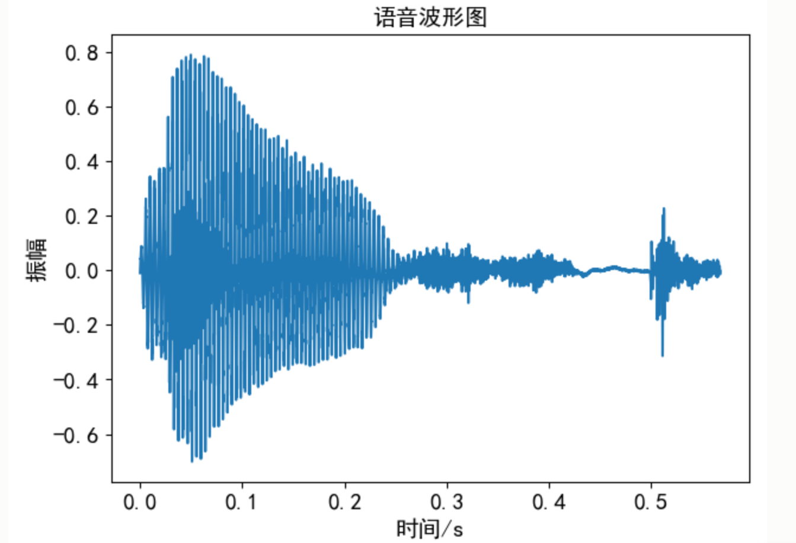
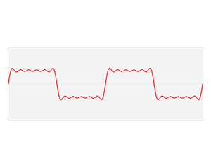

## 1. 采样

- **采样频率（Sample rate）**：每秒内对声音信号采样样本的总数目，44100Hz采样频率意味着每秒钟信号被分解成44100份。换句话说，每隔$\frac{1}{144100}$秒就会存储一次，如果采样率高，那么媒体播放音频时会感觉信号是连续的。
- **采样定理**：也称作奈奎斯特采样定理，只有采样频率高于声音信号最高**频率**的两倍时，才能把数字信号表示的声音还原成为原来的声音。所以采样定理确定了信号最高最高的频率上限，或能获取连续信号的所有信息的采样频率的下限。
- **带宽：**采样频率的一半，**最高频率等于采样频率的一半**。
- **混叠**也称为欠采样，当采样频率小于最大截止频率两倍（奈奎斯特频率）的时候就会发生信号重叠，这一现象叫做混叠。

## 2. 语谱图和频谱图

- 语音波形图：**波形图**表示语音信号的响度随时间变化的规律，**横坐标表示时间**，**纵坐标表示声音响度**，我们可以从时域波形图中观察语音信号随时间变化的过程以及语音能量的起伏

  

- 频谱图和相位图：**频谱图**表示语音信号的功率随频率变化的规律，信号频率与能量的关系用频谱表示，频谱图的**横轴为频率**，变化为采样率的一半（奈奎斯特采样定理），**纵轴为频率的强度（功率），**以分贝（dB）为单位。

  

- 语谱图：**横坐标是时间**，**纵坐标是频率**，**坐标点值为语音数据能量**，**能量值的大小是通过颜色来表示的**，颜色越深表示该点的能量越强。一条条横方向的条纹，称为“声纹”。它因人而异，即不同讲话者语谱图声纹是不同的，因而可以用声纹鉴定不同的讲话人。语谱图中的花纹有横杠、乱纹和竖直条等，横杠是和时间轴平行的几条深色带纹，它们相应于短时谱中的几个凸出点，即共振峰，有没有横杠出现是判断它是否是浊音的重要标志。

  

- **频谱图和语谱图的区别：**

  - 频谱图（spectrum）用于表示某一瞬间的波形图的频率分布，而语谱图则是研究一段时间内语音的变化，特别是频率的变化
  - 频谱图表达了声压或振幅和频率的关系，一个持续的元音可有一个稳定的频谱图，最低频率峰值即**基频**，而高频的峰值为**谐音或泛音**（Harmonics）
    - 正弦波中，频率最低的称为信号的基波，其余称为信号的谐波。
    - 基波只有一个，可以称为一次谐波，谐波可以有很多个，每次谐波的频率是基波频率的整数倍。谐波的大小可能互不相同。
  - 根据滤波器的带宽可将语谱图分为两类，带宽为300Hz的宽带语谱图可以显示细致的时间结构，但是谐波结构不太清楚；带宽为45Hz的窄语谱图使时间的结构模糊，但是频率的信息较好
  - 在频谱图包络可以有一些较宽的峰值，成为共振峰（formant）；在较宽的共振峰种可以看到个别的谐波频率

## 3. 量化

- 将**连续信号**近似为有限个**离散值**的过程。主要应用于从连续信号到数字信号的转换中。连续信号经过采样成为**离散信号**，离散信号经过量化就成为了**数字信号**。**连续信号**(模拟信号)经过采样成为**离散信号**（也称为采样信号），离散信号经过量化就成为了**数字信号**。
- 连续信号：信号连续，如正弦信；离散信号：信号不连续，只是一些离散的点，它的取值可以是无穷多种取值；
- 数字信号：如果是二进制量化，只有1，0两种模式的信号。四进制数字信号只有四种取值，以此类推。数字信号幅度只取几个量化的值代替区间。
- **量化位数（Bit depth）**：也称为“**位深**”，每个采样点中信息的比特(bit)数。1 byte等于8 bit。通常有8bit、16bit、24bit、32bit

## 4. 增益单位

- 本意是表示两个量的比值大小。dB的意义就是把就是把一个很大或者很小的数比较简短地表示出来

## 5. FFT（fast Fourier Transform）

离散傅里叶变换（DFT）对有限长时域离散信号的频谱进行等间隔采样，频域函数被离散化了，便于信号的计算机处理。DFT的运算量太大，FFT是离散傅里叶变换的快速算法。

在短时傅里叶变换过程中，窗的长度决定频谱图的时间分辨率和频率分辨率，窗长越长，截取的信号越长，信号越长，傅里叶变换后频率分辨率越高，时间分辨率越差；相反，窗长越短，截取的信号就越短，频率分辨率越差，时间分辨率越好，也就是说短时傅里叶变换中，时间分辨率和频率分辨率之间不能兼得，应该根据具体需求进行取舍。

- 三角函数

  - $y = A\cos(wx+\theta) + k$，其中A为振幅，函数周期为$\frac{2\pi}{w}$，频率是周期的倒数$\frac{w}{2\pi}$，$\theta$为函数的相位，$k$在信号处理成为直流分量，这个信号在频域就是一条竖线。

- 复杂时域函数

  - 复杂的时域函数$y=f(t)$，根据傅里叶的理论，任何一个周期函数可以被分解为一系列**振幅**A，**频率**ω或初**相位**θ正弦函数的叠加。（θ的多少决定了正弦波向右移动多少）

  - $y=A_1sin(ω_1t+θ_1)+A_2sin(ω_2t+θ_2)+A_3sin(ω_3t+θ_3)$

  - 该信号在频域有三条竖线组成，而竖线图我们把它称为**频谱图**

    

    

    

  - 通过时域到频域的变换，我们得到了一个从侧面看的频谱，但是这个频谱并没有包含时域中全部的信息。

    - **频谱只代表每个正弦波对应频率的振幅**是多少，而没有提到相位。
    - 基础的正弦波$Asin(wt+θ)$中，振幅，频率，相位缺一不可，**不同相位决定了波的位置**
    - 所以对于频域分析，仅仅有频谱（振幅谱）是不够的，我们还需要一个相位谱。

  - **将时域（即时间域）上的信号转变为频域（即频率域）上的信号**，看问题的角度也从时间域转到了频率域，因此在时域中某些不好处理的地方，在频域就可以较为简单的处理，这就可以大量减少处理信号计算量。

  - 信号经过傅里叶变换后，可以得到频域的**幅度谱**以及**相位谱**，信号的**幅度谱**和***\*相位谱\****是信号傅里叶变换后频谱的**两个属性**。

- Numpy

  - np.fft.fft(原序列)　　原函数值的序列经过快速傅里叶变换得到一个复数数组，**复数的模代表的是振幅，复数的辐角代表初相位**
  - np.fft.ifft(复数序列)　　复数数组 经过逆向傅里叶变换得到合成的函数值数组

- librosa

  - ```
    librosa.stft(y, n_fft=2048, hop_length=None, win_length=None, window='hann', center=True, pad_mode='reflect')
    ```

    - y：音频时间序列
    - n_fft：FFT窗口大小，n_fft=hop_length+overlapping
    - hop_length：帧移，如果未指定，则默认win_length / 4。
    - win_length：每一帧音频都由window（）加窗。窗长win_length，然后用零填充以匹配N_FFT。默认`win_length=n_fft`。
    - window：字符串，元组，数字，函数 shape =（n_fft, )
      - 窗口（字符串，元组或数字）；
      - 窗函数，例如`scipy.signal.hanning`
      - 长度为n_fft的向量或数组
    - center：bool
      - 如果为True，则填充信号y，以使帧 D [:, t]以y [t * hop_length]为中心。
      - 如果为False，则D [:, t]从y [t * hop_length]开始
    - dtype：D的复数值类型。默认值为64-bit complex复数
    - pad_mode：如果center = True，则在信号的边缘使用填充模式。默认情况下，STFT使用reflection padding。
    - **返回：**STFT矩阵D，$shape =（1 + \frac {nfft}2，t）$

  - ```
    librosa.magphase(D, power=1)
    ```

    - 将复值频谱D分离成其幅度（S）和相位（P）
    - **D**：复值谱图，np.ndarray [shape =（d，t），dtype = complex]
    - **power**：幅度谱图的指数，例如，1代表能量，2代表功率，等等。
    - **返回：**
      - **D_mag** ：D的幅值，np.ndarray [shape =（d，t），dtype = real]
      - **D_phase** ：D的相位，np.ndarray [shape =（d，t），dtype = complex]，$exp（1.j * phi）$*其中*phi*是*D*的相位

> 复数：
>
> - 实部虚部（直角坐标系）：$a+jb$
> - 幅度、相位（指数系）：$re^{j\theta}$  （r是幅值，θ是相角，$e^{j\theta}$是相位）
> - 指数系-->直角坐标系：$re^{j\theta} = r(cos\theta + jsin\theta) = rcos{\theta} + jrsin\theta$ 
>   - **实部**： $a=rcosθ$， real = np.real(S) 
>   - **虚部**：$b=rsinθ$， imag= np.imag(S) 
>   - **幅值**：$r=\sqrt{a^2+b^2}$， magnitude = np.abs(S) 或 magnitude = np.sqrt(real**2+imag**2) 
>   - **相角**(以弧度为单位rad)：$θ=tan^{−1}(\frac b a)$ 或$ θ=atan2(b,a)$。 angle = np.angle(D(F, T)) 
>   - **相角**(以角度为单位deg)：$deg=rad∗\frac{180}π$，$rad2deg(atan2(b,a))$。 deg = rad * 180/np.pi 
>   - **相位**： phase = np.exp(1j * np.angle(S)) 

## 6. Frequency bin

**frequency bin** 是指：raw data 经过FFT后得到的频谱图（频域率）中，**频率轴的频率间隔**或分辨率，通常取决采样率和采样点。

- $frequency bin = \frac{采样点}{采样点数} = \frac{f_{sample}}{N_{recode}}$，其中，$N_{recode}$是信号在时域的采样点数，频谱中的频率点或线的数量为$\frac{N_{recode}}{2}$
- 频点采用相等的间隔，这间隔通常用frequency bin（频率窗口）或FFT bin表示。


## 7. 比特率

- **比特率（Bit rate）**:每秒处理多少个Bit。比如一个单声道，用44.1KHz/16Bit的配置来说，它的比特率就为44100**16**1=705600，单位是bit/s(或者bps)，因为通常计算出来的数字都比较大，大家就用kbit/s了，也就是705.6kbit/s。在对音频进行压缩时，比特率就成为了我们的一个要选的选项了，越高的比特率，其音质也就越好。一些常用的比特率有：
  - 32kbit/s： 一般只适用于语音
  - 96kbit/s： 一般用于语音或低质量流媒体
  - 128或160kbit/s： 中等比特率质量
  - 192kbit/s： 中等质量比特率
  - 256kbit/s： 常用的高质量比特率
  - 320kbit/s： MP3标准支持的最高水平

## 8. 信号分帧

- 加窗

  - 矩形窗
  - 汉明窗（Hamming）
  - 海宁窗（Hanning）

- 重叠

  - 在分帧中，相邻两帧之间会有一部分重叠，帧长(wlen) = 重叠(overlap)+帧移(inc)，如果相邻两帧之间不重叠，那么由于窗函数的形状，截取到的语音帧边缘会出现损失，所以要设置重叠部分。

  - 加窗截断类似采样，为了保证相邻帧不至于差别过大，通常帧与帧之间有帧移，其实就是插值平滑的作用。

    

## 9. 基础库

- wave、pyaudio
- librosa
- numpy
- torchaudio
- scipy
- matplotlib.pyplot的specgram

> 参考：
>
> - [语音的频率、频率分辨率、采样频率、采样点数、量化、增益 - 凌逆战 - 博客园 (cnblogs.com)](https://www.cnblogs.com/LXP-Never/p/10619759.html)
> - [python做语音信号处理 - 凌逆战 - 博客园 (cnblogs.com)](https://www.cnblogs.com/LXP-Never/p/10078200.html)
> - 