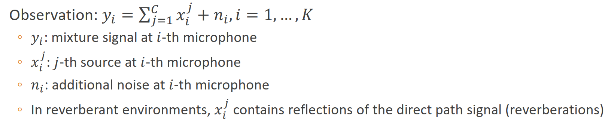
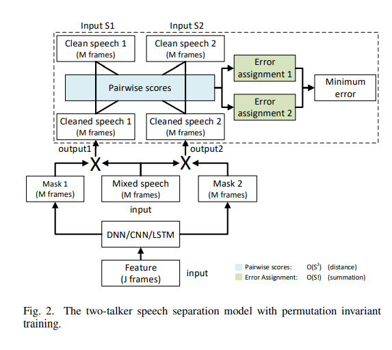
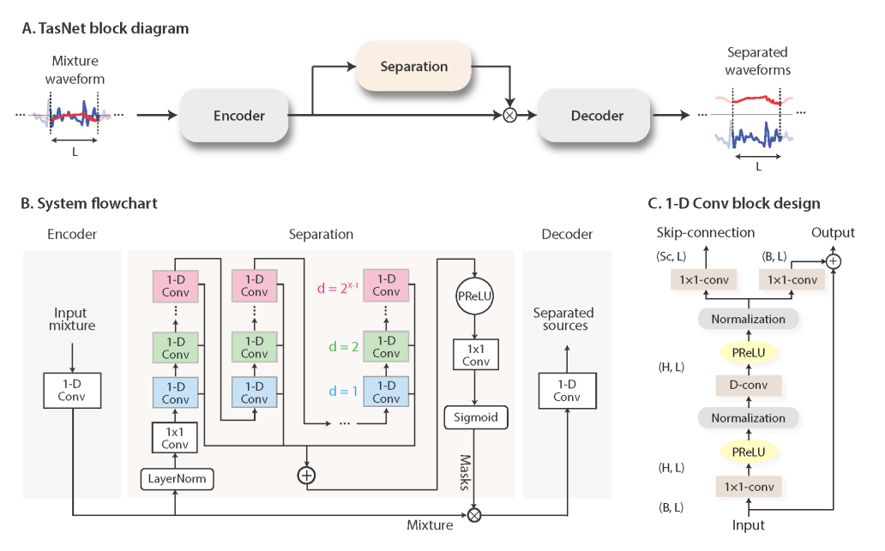

# 一、语音分离

- paperwithcode： [Speech Separation | Papers With Code](https://paperswithcode.com/task/speech-separation)

## 1.1 纯语音分离任务的基本设定

- 任务定义：语音分离的目的是分离目标声音与背景噪声（例如环境噪声，人声等）进行分离。(*鸡尾酒效应)，且语音分离的任务输入输出的长度是一样的。

  - speech enhancement

  - speaker separation：multi-speaker talking

  - 数学定义：

    目标函数：

    

    

- 任务分类：根据麦克风数量的不同，分为单通道(single-channel)和麦克风阵列(Multi-channel)的语音分离。

- 处理流程：混合信号，对于时域的语音信号通过短时傅里叶变化(STFT)，转为时频域信号。时频域的特征能够更好的进行信号特征的提取，例如MFCC等。此外，对于经过STFT的时域信号很容易通过iSTFT恢复成时域信号。

- 评价指标

  - SNR

    

  - SDR\SI-SDR

    

    

- 存在的挑战：

  - 输入一个混合的语音标签，输出多个非混合的语音标签。因为该任务是监督任务，所以我们需要对应真实的标签是我们的模型进行学习。同时对训练的模型要求是说话者无关的模型(speaker independent)，就是我们训练了一个模型可以应用到所有的说话人的语音分离。这就存在**标签置换问题。**

  - permutation issue

    > 例如：一个由固定个数输出的系统和三个待分离的说话人。在训练网络和计算损失函数的时候，两个输出需要人工指定一个顺序。
    >
    > 解决方案：
    >
    > - deep clustering
    > - deep attractor network基于高维embedding
    > - permutation invariant training

  - 未知说话人的个数

    - https://arxiv.org/pdf/1904.03065.pdf

  - 多麦克风阵列

- 数据集：

  - :heavy_check_mark: [WSJ0] [[Dataset Link]](https://catalog.ldc.upenn.edu/LDC93S6A)

    :heavy_check_mark: [WHAM & WHAMR] [[Dataset Link]](http://wham.whisper.ai/)

    :heavy_check_mark: [Microsoft DNS Challenge] [[Dataset Link]](https://github.com/microsoft/DNS-Challenge)

    :heavy_check_mark: [AVSpeech] [[Dataset Link]](https://looking-to-listen.github.io/avspeech/download.html)  视听

    :heavy_check_mark: [LRW] [[Dataset Link]](http://www.robots.ox.ac.uk/~vgg/data/lip_reading/lrw1.html)

    :heavy_check_mark: [LRS2] [[Dataset Link]](http://www.robots.ox.ac.uk/~vgg/data/lip_reading/lrs2.html)

    :heavy_check_mark: [LRS3] [[Dataset Link]](http://www.robots.ox.ac.uk/~vgg/data/lip_reading/lrs2.html) [[Multi Model Data Processing Script]](https://github.com/JusperLee/LRS3-For-Speech-Separationhttps://github.com/JusperLee/LRS3-For-Speech-Separation)

    :heavy_check_mark: [VoxCeleb] [[Dataset Link]](http://www.robots.ox.ac.uk/~vgg/data/voxceleb/)   视听

    :heavy_check_mark: [LibriMix] [[Dataset Link]](https://github.com/JorisCos/LibriMix)

    :heavy_check_mark: [LibriSS] [[Dataset Link]](https://github.com/yluo42/TAC/blob/master/data/create_dataset.py)  视听

- 相关概念：

  - speaker independent：测试集与验证集的说话者完全一致
  - end-to-end neural source separation：from waveform to waveform deep learning-based separation multiple sources from a mixture

### 1.1.1 基于频域的方法

### 1.1.2 基于时域的方法

## 1.2 纯语音分离任务的相关工作

### 1.2.1 深度聚类(deep clustering)

- 方法：通过神经网络对时频域的信号进行训练，然后构造的损失函数去预测和目标信号的同一个speaker的embedding的TF-bin更接近，最终可以通过简单的聚类算法将不同说话者进行分开

  - IBM：Ideal Binary Mask，通过IBM生成mask矩阵，而则合理使用了深度聚类的方式生成了mask矩阵

  > TF-bin：原始数据经过FFT后得到的频谱图，频率轴的频率间隔或分辨率取决于采样率：
  >
  > $ TF-Bin = 采样率/采样点数 $

  

- 优点：避免了标签的匹配问题，将标签的匹配转换为亲和力矩阵的匹配程度

- 缺点：亲和力矩阵的构造存在一定的问题，就是一个语音序列的TF-Bin非常大时，我们构造的亲和力矩阵也很大(TF*TF)。因此我们需要使用近似的方式，例如将TF-Bin转换为Embedding的维度D，这样就可以大大降低计算量。计算过程如下：

  > 

- 代码实现：[[code]](https://github.com/JusperLee/Deep-Clustering-forSpeech-Separation  )

- paper: [Deep clustering: Discriminative embeddings for segmentation and separation 2016 IEEE International Conference on Acoustics, Speech and Signal Processing (ICASSP)](https://arxiv.org/pdf/1508.04306.pdf)

### 1.2.2 帧级别和句子级别的标签不变训练(PIT&uPIT)

PIT：permutation Invariant Training

- 定义：置换不变性训练(PIT)，与深度聚类不同的是，该方法将分离误差最小化，直接进行了最小标签的排列组合。

- 方法：使用深度学习模型估计一组掩码(Mark)，使用softmax操作可以完成约束。然后通过mask点成混合频谱图，去估计单一声音的频谱图。

  

  

- 优化目标：最小化估计掩码与理想比率掩码(IRM)之间的均方误差(MSE)。

  > 

- 存在的问题：因静音端中，实际声音的mask=0且混合频段中的频谱图mask=0。所以将mask之间的差异直接转为频谱图之间的差异：

  > 

- 代码实现：[[code]](https://github.com/JusperLee/UtterancePIT-SpeechSeparation)

- paper：[[1607.00325\] Permutation Invariant Training of Deep Models for Speaker-Independent Multi-talker Speech Separation (arxiv.org)](https://arxiv.org/abs/1607.00325)

- [Multi-talker Speech Separation with Utterance-level Permutation Invariant Training of Deep Recurrent Neural Networks](https://arxiv.org/pdf/1703.06284.pdf)

### 1.2.3 深度吸引子网络(Deep Attractor NetWork)

- 解决的问题：DANet解决了深度聚类中目标函数与实际不符合的问题，同时解决了深度聚类中生成mask的时候是在预测部分无法学习的问题。

- 方法：使用深度吸引子网络通过深度聚类中对不同的speaker生成不同的mask

  

- [[代码实现]](https://github.com/JusperLee/DANet-For-SpeechSeparation)

- paper：[DEEP ATTRACTOR NETWORK FOR SINGLE-MICROPHONE SPEAKER SEPARATION](https://arxiv.org/pdf/1611.08930.pdf)

### 1.2.4 TasNet

- 特点：在时域上对音频进行分离，克服了短时傅里叶变化将时域信号转到时频域的精度问题。

- 方法：TasNet使用encoder-decoder框架在时域中直接对信号进行建模，并对非负编码器输出执行语音分离

  

  

- 优点：

  - 省去了频率分解的过程，省去了mask，直接由解码器进行合成
  - TasNet优于当前最新的因果和非因果的语音分离方法（因果分离就是不考虑信号的将来特征，例如RNN方法，而非因果分离则是考虑信号将来的特征），这降低了语音分离的计算成本，并显著的降低了输出所需的最小时延
  - TasNet是encoder-decoder框架，省去了time-domain转为frequency-domain的步骤
  - 使用卷积替代了STFT，因为STFT实际上也是卷积操作

- 目标函数：SI-SNR(尺度不变的信噪比)最大化，该信噪比通常用作替代标准的信噪比的心愿分离评估指标。

  > 

- code：

- paper：[TaSNet: Time-Domain Audio Separation Network for Real-Time, Single-Channel Speech Separation 2018 IEEE International Conference on Acoustics, Speech and Signal Processing (ICASSP)](https://arxiv.org/pdf/1711.00541.pdf)

- paperlist：

  - 改变encoder/decoder
    - two-step separation：first learn the linear encoder/decoder to reconstruct the input as good as possible, then freeze them during the training of the separator （Two-Step Sound Source Separation: Training On Learned Latent Targets.  ）
    - Multi-phase Gammatone filterbank [6]: mimic the behavior of human auditory system（A multi-phase gammatone filterbank for speech separation via tasnet.  ）
  - 改变目标函数objective
    - wavesplit：joint speaker identification and speaker separation（Wavesplit: End-to-end speech separation by speaker clustering.  ）
    - MulCat DPRNN：joint speaker indentification and speaker separation（Wavesplit: End-to-end speech separation by speaker clustering.  ）
  - 不同的训练任务
    - spEx/spEx+（SpEx: Multi-Scale Time Domain Speaker Extraction Network. SpEx+: A Complete Time Domain Speaker Extraction Network   ）
    - Music separation：higher sample rate and source-specific model parameters（Meta-learning Extractors for Music Source Separation  ）
    - Universal sound separation：going beyond speech and music（Universal sound separation  ）
    - Audio-visual（Improving universal sound separation using sound classification  ）

### 1.2.5 Conv-TasNet

- 方法：全卷积的时域音频分离网络

  - 使用线性编码器来生成语音波形的表示形式，该波形针对分离单个speaker进行了优化。
  - speaker分离是通过将一组加权函数(掩码)应用于编码器数出来实现的
  - 然后使用线性编码器修改后的编码器表示形式反转成波形。
  - 使用由堆叠的一维膨胀卷积块组成的时间卷积网络(TCN)查找掩码，这使网络可以对语音信号的长期依赖进行建模，同保持较小的模型尺寸（不同于RNN，换成了TCN）

  

- 优点：

  - 端到端的基于时域的方法
  - 使用TCN的方式可以通过GPU并行加速

- 实现代码：[[code]](https://github.com/JusperLee/Conv-TasNet)

- paper：[1809.07454.pdf (arxiv.org)](https://arxiv.org/pdf/1809.07454.pdf)

### 1.2.6 Dual-Path-RNN

- 目的：解决较长的语音信号

- 对比：传统的RNN模型无法高效处理较长的语音信号，一维卷积的感受野小于音频的长度，因此无法进行句子级别的语音分离。

- 方法：

  - 提出一种双路的DPRNN
  - DPRNN将较长的音频输入分成较小的块，并迭代应用块内和快间操作（组合成3D的特征块），使用块内特征和块间特征来分离语音
  - 其中输入长度（chunk size）可以与每个操作中的原始音频长度的平方成比例。块内RNN首先处理本地块（将长语音分为chunk number），然后快间RNN聚合来自所有块做句子级别的处理。

  

- 实现代码：[[code]](https://github.com/JusperLee/Dual-PathRNN-Pytorch)

- paper：[[1910.06379\] Dual-path RNN: efficient long sequence modeling for time-domain single-channel speech separation (arxiv.org)](https://arxiv.org/abs/1910.06379)

### 1.2.7 未知说话人的个数

- paper：https://arxiv.org/pdf/1904.03065.pdf

### 1.2.8 多麦克风阵列

- DeepBeam：output-based beamformers
- Beam-TasNet：output-based beamformers
- Neural network adaptive beamforming(NAB)：DNN beamformers
- Filter-and sum network(FaSNet) paper：https://arxiv.org/pdf/1909.13387.pdf
- multi-channel TasNet
- multi-channel wave-u-net

### 1.2.9 waveform to target waveforms  

- Wave-U-Net
- WaveNet-style model

https://www.nature.com/articles/s41598-020-80713-3)

## 1.3 多模态的语音分离任务的基本设定

- 任务定义：视听语音分离中可以很好的解决标签置换问题，视觉的特征信息用于将音频“聚焦”到场景中所需的说话者上，并改善语音分离的质量

## 1.4 多模态语音分离任务的相关工作

### 1.4.1 Looking to listen at the cocktail party

- Audio-only的方法不能提供视频中说话者语音与视频之间的关联。AV-model中的视觉功能用于将音频“聚焦”于场景中所需的说话者上，并改善语音分离的质量。在混合语音的情况下，AV-model显示出优于现有的纯音频语音分离的明显优势。另外，该方法是独立于说话者的（训练过一次，适用于任何说话者），比最近依赖于说话者的视听语音分离方法（要求针对每个感兴趣的说话者训练一个单独的模型）产生的效果更好  。
- 结构：
  - 输入：
    - 音频部分：将每个时帧(TF)包含复数的实部和虚部，将二者作为输入，执行power-law，以防止强的音频压倒低的音频。对噪声信号和纯净参考信号进行相同的处理。在实验中，分离模型可以应用于任意长度的视频片段。
    - 视频部分：给定一个包含多个演讲者的视频片段，我们使用现成的面部检测器mtcnn在每个帧上查找面部75张图片。在使用facenet将人脸图像提取成一个face embedding。对面部图像的原始像素进行了实验。
  - 输出：输出是一个乘法频谱 mask，它描述了 clean 语音与背景 noise 的时频关系。有研究人员观察到乘法掩模比其他方法（例如，频谱图幅度的直接预测或时域波形的直接预测）的工作效果更好  
- code：[code](https://github.com/JusperLee/Looking-to-Listenat-the-Cocktail-Party)

### 1.4.2 AV-model

​	使用 CNN 的方法得到的结果往往要比使用 RNN，LSTM，GRU 的方法要更精确。这是由于 CNN 方法首先可以大大的缩小训练和测试时间，可以更好的利用GPU。此外，由于 TCN 方法和 ResNet 方法的发展，CNN 网络也可以朝向更深层次发展，通过 Dilated Conv 操作可以使 CNN 也能获得序列的上下文语义，使 CNN 模型更能适合 RNN 网络的操作。因此 ConvTasNet 可以得到更好的结果。所以我们在设计我们的 AV-model 的时候，语音部分参考了 Conv-Tasnet 的Encoder 和 Separation 结构，而在视觉部分参考了端到端的 AudioVisual 语音识别的视觉信息部分。  

- 视觉输入：视频编码器包含一个嘴唇嵌入提取器，然后是几个时间卷积块。嘴唇嵌入提取器包括一个 3D 卷积层和一个 18 层 ResNet，1-Dconv 每个块由一个时间卷积组成，之后是 ReLU 激活和批处理归一化。我们使用 256 维嘴唇嵌入，并为所有块选择 3 个内核大小，1 个步幅大小和 512 个通道大小。
- 音频输入：我们借鉴 Conv-Tasnet 的分离网络和编码器网络。同时我们设定K 和 S 分别表示一维卷积运算中的内核大小和步幅。 在该模型中，我们默认使用K = 40 和 S = 20。其中步幅大小相当于短时傅里叶变换中的窗移动大小。
- 融合部分：融合视觉特征的过程是通过在卷积通道尺寸上进行简单的串联操作来执行的，然后进行位置投影 P 以减小特征尺寸。 为了同步音频和视频功能的时间分辨率，如有必要，请在连接之前对视频流进行上采样。  

- paper：[[1804.03619\] Looking to Listen at the Cocktail Party: A Speaker-Independent Audio-Visual Model for Speech Separation (arxiv.org)](https://arxiv.org/abs/1804.03619)

## 1.5 纯语音分离和多模态语音分离任务的挑战

# paper list

## pure speech separation

:heavy_check_mark: [Joint Optimization of Masks and Deep Recurrent Neural Networks for Monaural Source Separation, Po-Sen Huang, TASLP 2015] [[Paper]](https://arxiv.org/pdf/1502.04149) [[Code (posenhuang)]](https://github.com/posenhuang/deeplearningsourceseparation)

:heavy_check_mark: [Complex Ratio Masking for Monaural Speech Separation, DS Williamson, TASLP 2015] [[Paper]](https://ieeexplore.ieee.org/abstract/document/7364200/)

:heavy_check_mark: [Deep clustering: Discriminative embeddings for segmentation and separation, JR Hershey,  ICASSP 2016] [[Paper]](https://arxiv.org/abs/1508.04306) [[Code (Kai Li)]](https://github.com/JusperLee/Deep-Clustering-for-Speech-Separation) [[Code (funcwj)]](https://github.com/funcwj/deep-clustering) [[Code (asteroid)]](https://github.com/mpariente/asteroid/blob/master/egs/wsj0-mix/DeepClustering)

:heavy_check_mark: [Single-channel multi-speaker separation using deep clustering, Y Isik, Interspeech 2016] [[Paper]](https://arxiv.org/pdf/1607.02173) [[Code (Kai Li)]](https://github.com/JusperLee/Deep-Clustering-for-Speech-Separation) [[Code (funcwj)]](https://github.com/funcwj/deep-clustering)

:heavy_check_mark: [Permutation invariant training of deep models for speaker-independent multi-talker speech separation, Dong Yu, ICASSP 2017] [[Paper]](https://arxiv.org/pdf/1607.00325) [[Code (Kai Li)]](https://github.com/JusperLee/UtterancePIT-Speech-Separation)

:heavy_check_mark: [Recognizing Multi-talker Speech with Permutation Invariant Training, Dong Yu, ICASSP 2017] [[Paper]](https://arxiv.org/pdf/1704.01985)

:heavy_check_mark: [Multitalker speech separation with utterance-level permutation invariant training of deep recurrent neural networks, M Kolbæk, TASLP 2017] [[Paper]](https://arxiv.org/pdf/1703.06284) [[Code (Kai Li)]](https://github.com/JusperLee/UtterancePIT-Speech-Separation)

:heavy_check_mark: [Deep attractor network for single-microphone speaker separation, Zhuo Chen, ICASSP 2017] [[Paper]](https://arxiv.org/abs/1611.08930) [[Code (Kai Li)]](https://github.com/JusperLee/DANet-For-Speech-Separation)

:heavy_check_mark: [A consolidated perspective on multi-microphone speech enhancement and source separation, Sharon Gannot, TASLP 2017] [[Paper]](https://ieeexplore.ieee.org/document/7805139)

:heavy_check_mark: [Alternative Objective Functions for Deep Clustering, Zhong-Qiu Wang, ICASSP 2018] [[Paper]](http://www.merl.com/publications/docs/TR2018-005.pdf)

:heavy_check_mark: [End-to-End Speech Separation with Unfolded Iterative Phase Reconstruction Zhong-Qiu Wang et al. 2018] [[Paper]](https://arxiv.org/pdf/1804.10204.pdf)

:heavy_check_mark: [Speaker-independent Speech Separation with Deep Attractor Network, Luo Yi, TASLP 2018] [[Paper]](https://arxiv.org/pdf/1707.03634) [[Code (Kai Li)]](https://github.com/JusperLee/DANet-For-Speech-Separation)

:heavy_check_mark: [Tasnet: time-domain audio separation network for real-time, single-channel speech separation, Luo Yi, ICASSP 2018] [[Paper]](https://arxiv.org/pdf/1711.00541) [[Code (Kai Li)]](https://github.com/JusperLee/Conv-TasNet) [[Code (asteroid)]](https://github.com/mpariente/asteroid/blob/master/egs/whamr/TasNet)

:heavy_check_mark: [Supervised Speech Separation Based on Deep Learning An Overview, DeLiang Wang, Arxiv 2018] [[Paper]](https://arxiv.org/ftp/arxiv/papers/1708/1708.07524.pdf) 

:heavy_check_mark: [An Overview of Lead and Accompaniment Separation in Music, Zafar Rafi, TASLP 2018] [[Paper]](https://arxiv.org/pdf/1804.08300) 

:heavy_check_mark: [Conv-TasNet: Surpassing Ideal Time-Frequency Magnitude Masking for Speech Separation, Luo Yi, TASLP 2019] [[Paper]](https://ieeexplore.ieee.org/iel7/6570655/6633080/08707065.pdf) [[Code (Kai Li)]](https://github.com/JusperLee/Conv-TasNet) [[Code (asteroid)]](https://github.com/mpariente/asteroid/blob/master/egs/wham/ConvTasNet)

:heavy_check_mark: [Divide and Conquer: A Deep CASA Approach to Talker-independent Monaural Speaker Separation, Yuzhou Liu, TASLP 2019] [[Paper]](https://arxiv.org/pdf/1904.11148) [[Code]](https://github.com/yuzhou-git/deep-casa)

:heavy_check_mark: [Dual-path RNN: efficient long sequence modeling for time-domain single-channel speech separation, Luo Yi, Arxiv 2019] [[Paper]](https://arxiv.org/pdf/1910.06379) [[Code (Kai Li)]](https://github.com/JusperLee/Dual-Path-RNN-Pytorch)

:heavy_check_mark: [End-to-end Microphone Permutation and Number Invariant Multi-channel Speech Separation, Luo Yi, Arxiv 2019] [[Paper]](https://arxiv.org/pdf/1910.14104) [[Code]](https://github.com/yluo42/TAC)

:heavy_check_mark: [FaSNet: Low-latency Adaptive Beamforming for Multi-microphone Audio Processing, Yi Luo , Arxiv 2019] [[Paper]](https://arxiv.org/abs/1909.13387)

:heavy_check_mark: [A comprehensive study of speech separation: spectrogram vs waveform separation, Fahimeh Bahmaninezhad, Interspeech 2019] [[Paper]](https://arxiv.org/pdf/1905.07497)

:heavy_check_mark: [Discriminative Learning for Monaural Speech Separation Using Deep Embedding Features, Cunhang Fan, Interspeech 2019] [[Paper]](https://www.isca-speech.org/archive/Interspeech_2019/pdfs/1940.pdf)

:heavy_check_mark: [Interrupted and cascaded permutation invariant training for speech separation, Gene-Ping Yang, ICASSP, 2020][[Paper]](https://arxiv.org/abs/1910.12706)

:heavy_check_mark: [FurcaNeXt: End-to-end monaural speech separation with dynamic gated dilated temporal convolutional networks, Liwen Zhang, MMM 2020] [[Paper]](https://arxiv.org/pdf/1902.04891)

:heavy_check_mark: [Filterbank design for end-to-end speech separation, Manuel Pariente et al., ICASSP 2020] [[Paper]](https://128.84.21.199/abs/1910.10400)

:heavy_check_mark: [Voice Separation with an Unknown Number of Multiple Speakers, Eliya Nachmani, Arxiv 2020] [[Paper]](https://arxiv.org/pdf/2003.01531.pdf) [[Demo]](https://enk100.github.io/speaker_separation/)

:heavy_check_mark: [AN EMPIRICAL STUDY OF CONV-TASNET, Berkan Kadıoglu , Arxiv 2020] [[Paper]](https://arxiv.org/pdf/2002.08688.pdf) [[Code]](https://github.com/JusperLee/Deep-Encoder-Decoder-Conv-TasNet)

:heavy_check_mark: [Voice Separation with an Unknown Number of Multiple Speakers, Eliya Nachmani, Arxiv 2020] [[Paper]](https://arxiv.org/pdf/2003.01531.pdf)

:heavy_check_mark: [Wavesplit: End-to-End Speech Separation by Speaker Clustering, Neil Zeghidour et al. Arxiv 2020 ] [[Paper]](https://arxiv.org/abs/2002.08933)

:heavy_check_mark: [La Furca: Iterative Context-Aware End-to-End Monaural Speech Separation Based on Dual-Path Deep Parallel Inter-Intra Bi-LSTM with Attention, Ziqiang Shi, Arxiv 2020] [[Paper]](https://arxiv.org/pdf/2001.08998.pdf)

:heavy_check_mark: [Enhancing End-to-End Multi-channel Speech Separation via Spatial Feature Learning, Rongzhi Gu, Arxiv 2020] [[Paper]](https://arxiv.org/abs/2003.03927)

:heavy_check_mark: [Deep Attention Fusion Feature for Speech Separation with End-to-End Post-filter Method, Cunhang Fan, Arxiv 2020] [[Paper]](https://arxiv.org/abs/2003.07544)

:heavy_check_mark: [Enhancing End-to-End Multi-channel Speech Separation via Spatial Feature Learning, Rongzhi Guo, ICASSP 2020] [[Paper]](https://arxiv.org/pdf/2003.03927.pdf)

:heavy_check_mark: [A Multi-Phase Gammatone Filterbank for Speech Separation Via Tasnet, David Ditter, ICASSP 2020] [[Paper]](https://ieeexplore.ieee.org/abstract/document/9053602) [[Code]](https://github.com/sp-uhh/mp-gtf)

:heavy_check_mark: [Lightweight U-Net Based Monaural Speech Source Separation for Edge Computing Device, Kwang Myung Jeon, ICCE 2020] [[Paper]](https://ieeexplore.ieee.org/abstract/document/9043051)

:heavy_check_mark: [LibriMix: An Open-Source Dataset for Generalizable Speech Separation, Joris Cosentino, Arxiv 2020] [[Paper]](https://arxiv.org/pdf/2005.11262) [[Code]](https://github.com/JorisCos/LibriMix)

:heavy_check_mark: [An End-to-end Architecture of Online Multi-channel Speech Separation, Jian Wu, Interspeech 2020] [[Paper]](https://arxiv.org/pdf/2009.03141.pdf)

:heavy_check_mark: [SAGRNN: Self-Attentive Gated RNN for Binaural Speaker Separation with Interaural Cue Preservation, Ke Tan, IEEE Signal Processing Letters] [[Paper]](https://arxiv.org/pdf/2009.01381.pdf)

:heavy_check_mark: [A convolutional recurrent neural network with attention framework for speech separation in monaural recordings, Chao Sun, Scientific Reports] [[Paper]](

## Multi-Model Speech Separation

:heavy_check_mark: [Audio-Visual Speech Enhancement Using Multimodal Deep Convolutional Neural Networks, Jen-Cheng Hou, TETCI 2017] [[Paper]](https://arxiv.org/pdf/1703.10893) [[Code]](https://github.com/avivga/audio-visual-speech-enhancement)

:heavy_check_mark: [The Conversation: Deep Audio-Visual Speech Enhancement, Triantafyllos Afouras, Interspeech 2018] [[Paper]](https://arxiv.org/pdf/1804.04121)

:heavy_check_mark: [End-to-end audiovisual speech recognition, Stavros Petridis, ICASSP 2018] [[Paper]](https://arxiv.org/pdf/1802.06424) [[Code]](https://github.com/mpc001/end-to-end-lipreading)

:heavy_check_mark: [The Sound of Pixels, Hang Zhao, ECCV 2018] [[Paper]](http://openaccess.thecvf.com/content_ECCV_2018/papers/Hang_Zhao_The_Sound_of_ECCV_2018_paper.pdf) [[Code]](https://github.com/hangzhaomit/Sound-of-Pixels)

:heavy_check_mark: [Looking to Listen at the Cocktail Party: A Speaker-Independent Audio-Visual Model for Speech Separation, ARIEL EPHRAT, ACM Transactions on Graphics 2018] [[Paper]](https://arxiv.org/pdf/1804.03619) [[Code]](https://github.com/JusperLee/Looking-to-Listen-at-the-Cocktail-Party)

:heavy_check_mark: [Learning to Separate Object Sounds by Watching Unlabeled Video, Ruohan Gao, ECCV 2018] [[Paper]](http://openaccess.thecvf.com/content_ECCV_2018/papers/Ruohan_Gao_Learning_to_Separate_ECCV_2018_paper.pdf)

:heavy_check_mark: [Time domain audio visual speech separation, Jian Wu, Arxiv 2019] [[Paper]](https://arxiv.org/pdf/1904.03760)

:heavy_check_mark: [Audio-Visual Speech Separation and Dereverberation with a Two-Stage Multimodal Network, Ke Tan, Arxiv 2019] [[Paper]](https://arxiv.org/pdf/1909.07352)

:heavy_check_mark: [Co-Separating Sounds of Visual Objects, Ruohan Gao, ICCV 2019] [[Paper]](http://openaccess.thecvf.com/content_ICCV_2019/papers/Gao_Co-Separating_Sounds_of_Visual_Objects_ICCV_2019_paper.pdf) [[Code]](https://github.com/rhgao/co-separation)

:heavy_check_mark: [Multi-modal Multi-channel Target Speech Separation, Rongzhi Guo, J-STSP 2020] [[Paper]](https://arxiv.org/pdf/2003.07032.pdf)

:heavy_check_mark: [VisualVoice: Audio-Visual Speech Separation with Cross-Modal Consistency, Rongzhi Guo, Arxiv 2021] [[Paper]](https://arxiv.org/pdf/2101.03149.pdf)

## Evaluation index

:heavy_check_mark: [Performance measurement in blind audio sourceseparation, Emmanuel Vincent et al., TASLP 2004] [[Paper]](https://hal.inria.fr/inria-00544230/document)

:heavy_check_mark: [SDR – Half-baked or Well Done?, Jonathan Le Roux, ICASSP 2019] [[Paper]](